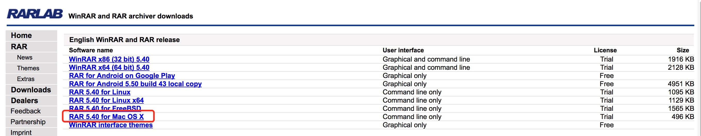

# rar
Install command line RAR and UnRAR tools on Mac OS X 

====
由于原生MAC不支持`rar`格式的解压缩文件操作,所以我们需要自己添加操作...     

Step 1 : [下载 RARLab](http://www.rarlab.com/download.htm),到download目录（默认）...     


Step 2 : 解压下载文件`rarosx-5.4.0.tar.gz` ,这里版本有可能不同，

```shell
tar -xvf rarosx-5.4.0.tar.gz
```

Step 3 : 进入解压后的目录`rar` 然后执行安装命令,需输入Mac密码

```shell
cd rar

sudo install -c -o $USER unrar /usr/local/bin

sudo install -c -o $USER rar /usr/local/bin

```

Step 4 : 测试

```shell
unrar x filename.rar
```


## Homebrew to install UNRAR
可以使用Homebrew安装unrar

```brew install unrar```

这中方式只安装了`unrar`，如果需要`rar`还需要通过上面命令方式安装

## 参考文档

[`Install command line RAR and UnRAR tools on Mac OS X (updated for Yosemite 10.10.x)`](http://best-mac-tips.com/2013/02/01/install-free-command-line-unrar-mac/)